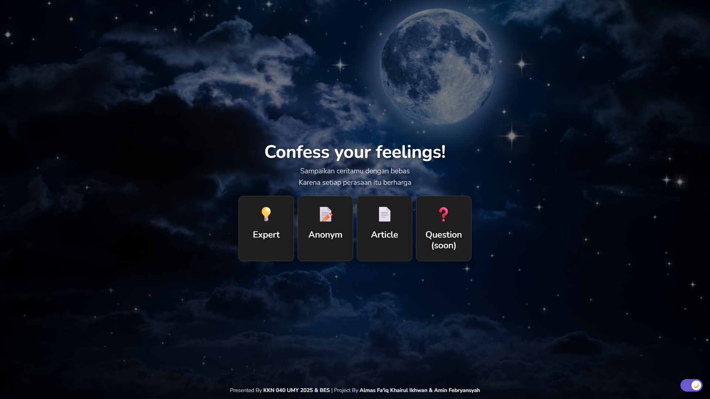

# Ruang Cerita & Konseling (katabercerita.com)

> Sebuah platform berbasis web yang menyediakan ruang aman bagi pengguna untuk berbagi cerita secara anonim atau berkonsultasi langsung dengan para ahli. Proyek ini dikembangkan sebagai bagian dari program KKN 040 UMY 2025 dan sekarang telah dihosting di **[katabercerita.com](http://katabercerita.com)**.

---

## 📸 Tampilan Proyek

Berikut adalah tampilan halaman utama dari website ini.

---

## 🚀 Fitur Utama

* **Pengakuan Anonim:** Pengguna dapat mengirimkan cerita atau perasaan mereka tanpa perlu mengungkap identitas.
* **Konsultasi Ahli:** Menyediakan daftar ahli (psikolog/konselor) yang dapat dihubungi langsung oleh pengguna melalui WhatsApp untuk sesi konsultasi.
* **Daftar Ahli yang Tersedia:**
    * Dr. H. M. Bambang Edi Susyanto, Sp.A., M.Kes.
    * Shanti Warda Ns., M. Kep., Sp. Jiwa., PH, D.
* **Mode Gelap (Dark Mode):** Tampilan antarmuka yang nyaman digunakan pada malam hari.
* **Desain Responsif:** Tampilan yang menyesuaikan dengan berbagai ukuran layar, baik desktop maupun mobile.
* **[Segera Hadir] Fitur Tanya Jawab:** Fitur untuk sesi tanya jawab interaktif.

---

## 🛠️ Teknologi yang Digunakan

Proyek ini dibangun menggunakan teknologi web standar yang modern:

* **HTML5:** Untuk struktur konten website.
* **CSS3:** Untuk styling dan desain visual.
* **Bootstrap 5:** Framework CSS untuk membangun antarmuka yang responsif dan modern dengan cepat.
* **JavaScript:** Untuk fungsionalitas interaktif di sisi klien.

---

## 📈 Status Proyek

Proyek ini telah selesai dikembangkan dan diluncurkan sebagai bagian dari program KKN 040 UMY 2025. Pemeliharaan atau penambahan fitur di masa depan mungkin dilakukan sesuai kebutuhan.

---

## 🙏 Ucapan Terima Kasih

Proyek ini tidak akan terwujud tanpa dukungan dan kolaborasi dari berbagai pihak:
* **KKN 040 UMY 2025 & BES** sebagai penyelenggara program.
* **Amin Febryansyah** sebagai rekan tim dalam pengembangan proyek ini.

---

## 👤 Kontak Kreator

Dibuat oleh **Almas Fa'iq Khairul Ikhwan**.

* **GitHub:** [@almasfaiqkh](https://github.com/almasfaiqkh)
* **LinkedIn:** [Almas Fa'iq Khairul Ikhwan](https://www.linkedin.com/in/almasfaiqkh/)
